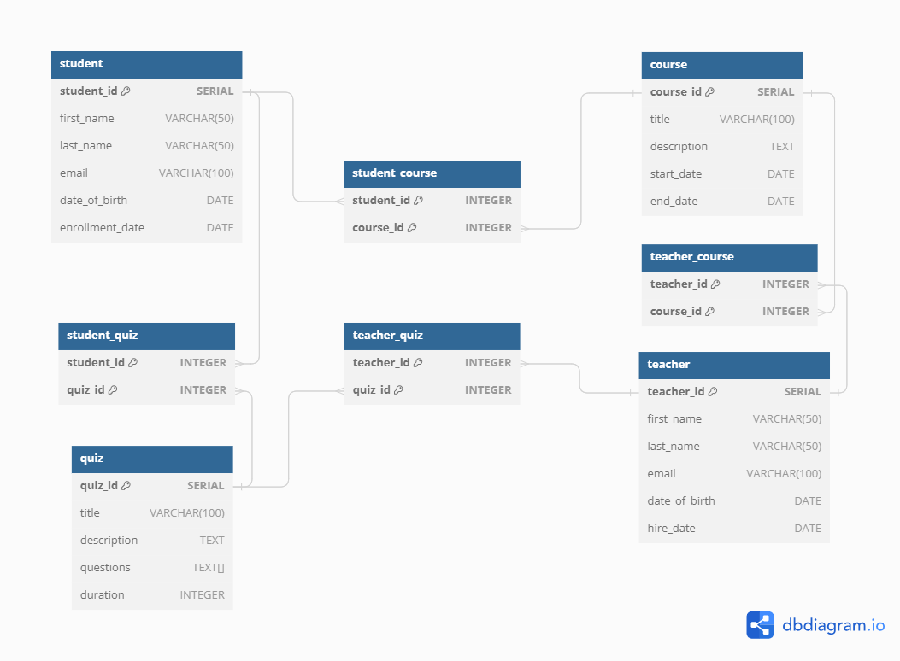

# Student Management System Backend

## About the project

Spring MVC Implementation for a Student System.

## Getting started

1. clone the repo for your workspace using this command `git clone https://github.com/abdallahalseddek/Student-System.git`
2. configure the PostgresSQL database username & password according to your machine
3. run the application using your IDE or maven commands
4. you can execute this [mock-data](/src/main/resources/mock-data.sql)  to test `Get` functions.
5. use [swagger](#swagger-usage) to test the endpoints

### Prerequisites

- [Java 17](https://openjdk.java.net/)
- [Maven](https://maven.apache.org/)
- [PostgreSQL](www.postgresql.org)

## Overview

**Student System** Allow the user to apply CRUD operation to Teacher, Student, Courses, and Quizzes. 
System flow may b.
e figured by having a look in the Entity Relational Diagram:

### Dev run

- `mvn clean package -DskipTests=True`

### SWAGGER USAGE

Hit swagger URL in browser
[Swagger](http://localhost:8080/swagger-ui/index.html)

### My Task List

- [x] Entities [Student, Teacher, Quiz, Course]
- [x] Service Layer [StudentService, TeacherService, QuizService, CourseService]
- [x] Controller Layer [StudentController, TeacherController, QuizController, CourseController] 
- [x] XML Config [hibernate.xml, spring-context.xml, mvc.xml,web.xml]
- [x] Database Configuration
- [x] CRUD Operations
- [x] Github Upload
- [x] Swagger Documentation